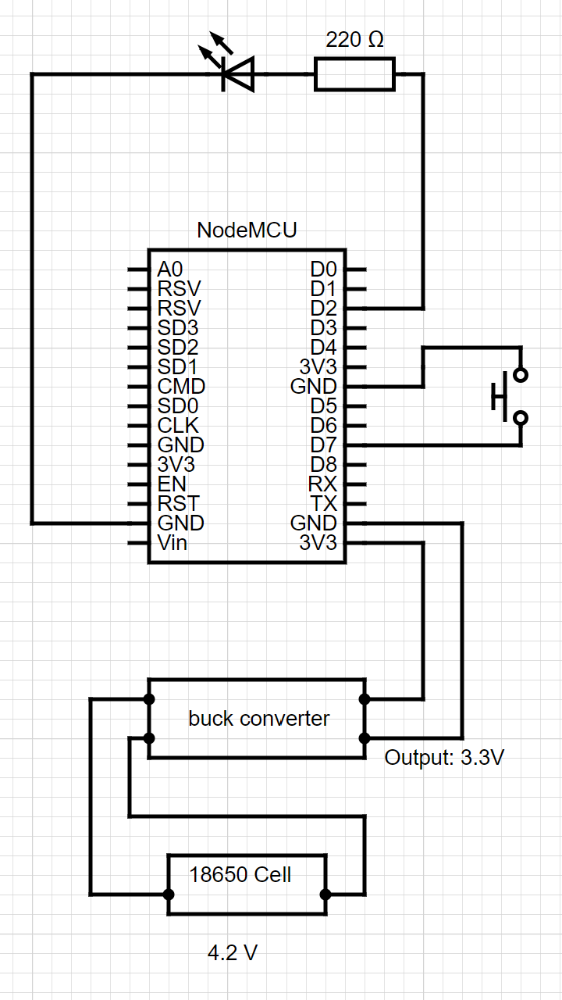
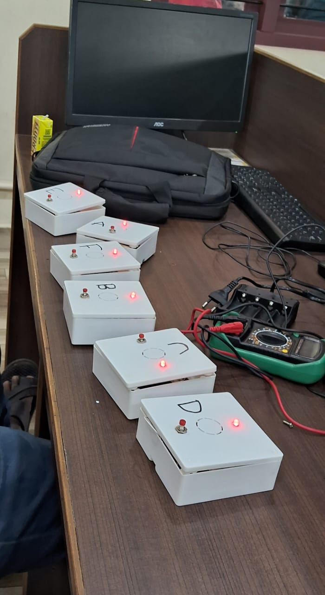

# Enquesta Buzzer

## Buzzer

Each buzzer is made of the following parts:

* ESP8266 Node MCU Module (with WiFi)
* Red LED
* Push Button
* 18650 Li-Ion Battery
* 1U 18650 Battery Holder
* Jumper Wires
* CCTV Box (to hold all the parts together)

The Schematic is as follows:


After all the connection are made, the buzzer will look like this:


A small hole was made for the micro-usb port of the Node MCU.

## Software

Step 1: First set up a mobile hotspot where you can connect your laptop, and the six buzzers.

Step 2: Download or clone the repository.

Step 3: Install virtualenv
```
pip install virtualenv
```
Step 4: Make a virtual environment
```
python -m virtualenv buzzer
```

## Buzzer

Each buzzer is made of the following parts:

* ESP8266 Node MCU Module (with WiFi)
* Red LED
* Push Button
* 18650 Li-Ion Battery
* 1U 18650 Battery Holder
* Jumper Wires
* CCTV Box (to hold all the parts together)

The Schematic is as follows:


After all the connection are made, the buzzer will look like this:


A small hole was made for the micro-usb port of the Node MCU.

## Software

Step 1: First set up a mobile hotspot where you can connect your laptop, and the six buzzers.

Step 2: Download or clone the repository.

Step 3: Move to the code directory
```
cd code
```

Step 4: Install virtualenv

For Linux:
```
pip install virtualenv
```

For Windows:
```
pip install virtualenv
```

Step 5: Make a virtual environment
```
python -m virtualenv buzz
```

Step 6: Activate Virtual Environment

For Linux:
```
source buzz/bin/activate
```

For Windows:
```
.\buzz\Scripts\activate
```

Step 7: Install all dependencies
```
pip install -r requirements.txt
```

Step 8: Run manage.py
```
python manage.py
```

Step 9: Note down the IP address in the hotspot network. (eg: http://192.168.x.x/5000)

Step 10: Download the Arduino IDE

Step 11: Go to File > Preferences and add 'http://arduino.esp8266.com/stable/package_esp8266com_index.json' to the Additional Board Manager URLs

Step 12: Use the shortcut `Ctrl+Shitf+B` to open the Board Manager and install the ep8266 board files.

Step 13: Steps 11 and 12 can be followed using this guid: 'https://www.instructables.com/Steps-to-Setup-Arduino-IDE-for-NODEMCU-ESP8266-WiF/'

Step 14: Install the following libraries using the Library Manager (`Ctrl+Shift+I`) - Arduino_JSON by Arduino

Step 15: Use the code in `arduino_ide/code.ino`. Replace the WiFi SSID and Password with the SSID and password of the Network. Also change IP address according to the IP address of the server.

Step 16: Change the buzzer number 1/2/3/4/5/6 according to which buzzer you are flashing.

Step 17: Once all buzzers are flashed they will start working as expected.